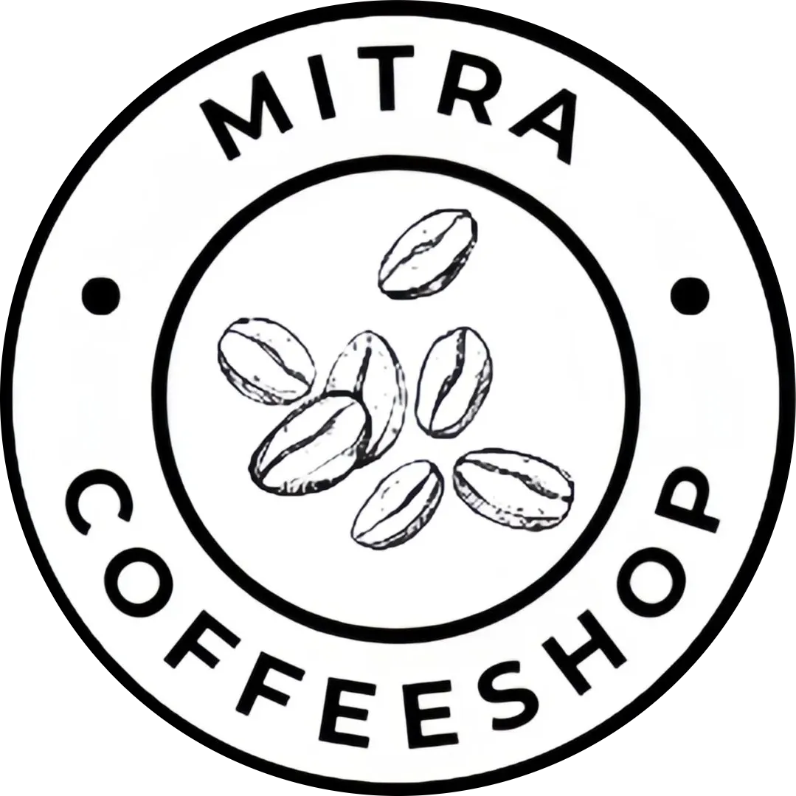

<p align="center">
  
</p>

<h1 align="center">Mitra Coffeeshop</h1>

<p align="center">
  <strong>Premium Coffee Experience at SMK Mitra Industri</strong>
</p>

<p align="center">
  <a href="https://coffeeshop.itmivhs.net" target="_blank">
    
  </a>
</p>

<p align="center">
  
  
  
  
</p>

---

### 🌐 Live Demo

Website sudah di-deploy dan dapat diakses di:

> **[https://coffeeshop.itmivhs.net](https://coffeeshop.itmivhs.net)**

---

### 🛠️ Tech Stack

<p align="left">
  <a href="https://skillicons.dev">
    
  </a>
</p>

Project ini mengimplementasikan arsitektur modern untuk menjamin performa maksimal:

*   **Runtime:** Bun — Eksekusi JavaScript berperforma tinggi.
*   **Framework:** TanStack Start — Full-stack React dengan Type-safe routing.
*   **Styling:** Tailwind CSS v4 — High-performance CSS engine.
*   **Motion:** Framer Motion untuk animasi UI.

---

### 🚀 Fitur Utama

- **Magazine Layout:** Estetika asimetris yang responsif dan modern.
- **Interactive Loyality Card:** Kartu loyalitas dengan animasi 3D Flip (CSS3).
- **Dynamic Menu Marquee:** Ticker teks untuk display menu unggulan.
- **WhatsApp Integration:** Akses cepat untuk pemesanan dan reservasi.
- **GoFood Integration:** Konektivitas langsung ke ekosistem pesan antar.

---

### 💻 Panduan Penggunaan

#### 1. Persiapan Lingkungan
Pastikan **Bun** telah terpasang di sistem Anda.

```bash
# Inisialisasi Repositori
git clone https://github.com/teamitmivhs/Mitra-Coffeeshop
cd mitra-coffeeshop

# Instalasi Dependensi
bun install
```

#### 2. Mode Pengembangan
```bash
bun dev
```
Akses server lokal: `http://localhost:3000`

#### 3. Produksi
```bash
bun build
```

---

### 📂 Struktur Proyek

```text
├── src/
│   ├── assets/          # Static Media Resources
│   ├── components/      # UI Component Library
│   ├── lib/             # Utilities & Configurations
│   ├── routes/          # File-based Routing
│   └── styles.css       # Tailwind v4 Design System
└── package.json         # Project Dependencies
```

---

### 📄 Lisensi

Didistribusikan di bawah Lisensi MIT. Lihat file `LICENSE` untuk informasi lebih lanjut.

---

<p align="center">
  <strong>Mitra Coffeeshop Project</strong><br>
  <em>Brewing Excellence for SMK Mitra Industri.</em>
</p>
